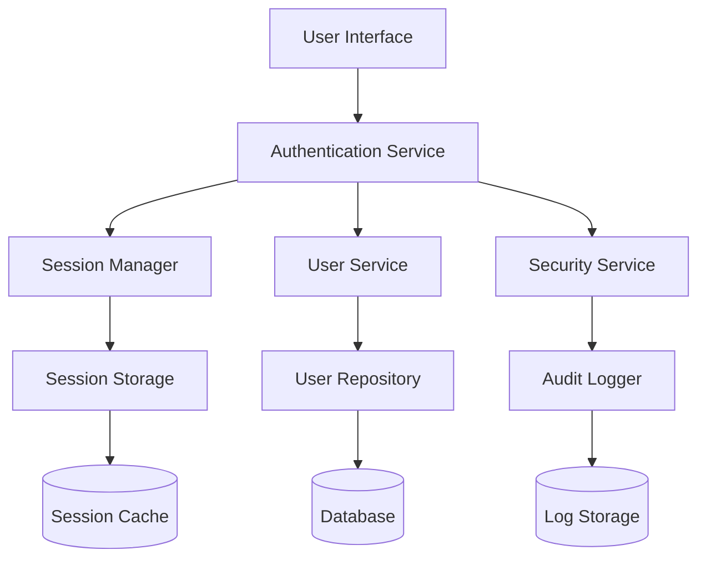

# User Authentication System Design

## Overview

The user authentication system provides secure identity verification and session management through a layered architecture. The system implements industry-standard security practices including password hashing, secure session management, and protection against common attacks like brute force and timing attacks.

The design follows a modular approach with clear separation between authentication logic, data persistence, and user interface components. This enables maintainability, testability, and future extensibility for features like multi-factor authentication or OAuth integration.

## Architecture

The system uses a three-tier architecture:

1. **Presentation Layer**: User interface components for login, registration, and password reset forms
2. **Business Logic Layer**: Authentication services, session management, and security enforcement
3. **Data Access Layer**: User repository, session storage, and audit logging



## Components and Interfaces

### Authentication Service
Central orchestrator for all authentication operations:
- `register(email, password): Promise<User>`
- `login(email, password): Promise<Session>`
- `logout(sessionId): Promise<void>`
- `initiatePasswordReset(email): Promise<void>`
- `resetPassword(token, newPassword): Promise<void>`

### User Service
Manages user account operations:
- `createUser(userData): Promise<User>`
- `findByEmail(email): Promise<User | null>`
- `updatePassword(userId, hashedPassword): Promise<void>`
- `verifyEmail(userId): Promise<void>`

### Session Manager
Handles session lifecycle and validation:
- `createSession(userId): Promise<Session>`
- `validateSession(sessionId): Promise<Session | null>`
- `extendSession(sessionId): Promise<void>`
- `invalidateSession(sessionId): Promise<void>`

### Security Service
Implements security measures and validation:
- `hashPassword(password): Promise<string>`
- `verifyPassword(password, hash): Promise<boolean>`
- `generateResetToken(): string`
- `validatePasswordStrength(password): boolean`
- `checkRateLimit(identifier): Promise<boolean>`

## Data Models

### User Model
```typescript
interface User {
  id: string;
  email: string;
  passwordHash: string;
  emailVerified: boolean;
  createdAt: Date;
  lastLoginAt: Date | null;
  failedLoginAttempts: number;
  lockedUntil: Date | null;
}
```

### Session Model
```typescript
interface Session {
  id: string;
  userId: string;
  createdAt: Date;
  expiresAt: Date;
  lastAccessedAt: Date;
  ipAddress: string;
  userAgent: string;
}
```

### Password Reset Token Model
```typescript
interface PasswordResetToken {
  token: string;
  userId: string;
  createdAt: Date;
  expiresAt: Date;
  used: boolean;
}
```
## Correctness Properties

*A property is a characteristic or behavior that should hold true across all valid executions of a system-essentially, a formal statement about what the system should do. Properties serve as the bridge between human-readable specifications and machine-verifiable correctness guarantees.*

### Property Reflection

After analyzing all acceptance criteria, several properties can be consolidated to eliminate redundancy:
- Registration validation properties (1.3, 1.4) can be combined into input validation
- Login failure properties (2.2, 2.3) can be combined into authentication rejection
- Session management properties (6.1, 6.2) can be combined into session lifecycle
- Security logging properties (3.4, 5.5) can be combined into audit trail

### Core Properties

**Property 1: User registration with valid credentials**
*For any* valid email and secure password, registration should create a new user account with properly hashed credentials
**Validates: Requirements 1.1**

**Property 2: Duplicate email prevention**
*For any* email address, attempting to register twice should reject the second registration attempt
**Validates: Requirements 1.2**

**Property 3: Input validation rejection**
*For any* invalid email format or weak password, registration should be rejected with appropriate error messages
**Validates: Requirements 1.3, 1.4**

**Property 4: Registration email notification**
*For any* successful registration, an email verification message should be sent to the provided email address
**Validates: Requirements 1.5**

**Property 5: Valid login creates session**
*For any* verified user with correct credentials, login should create a valid session and grant access
**Validates: Requirements 2.1**

**Property 6: Invalid authentication rejection**
*For any* invalid credentials or unverified email, login attempts should be rejected with appropriate error messages
**Validates: Requirements 2.2, 2.3**

**Property 7: Login timestamp recording**
*For any* successful login, the system should update the user's last login timestamp
**Validates: Requirements 2.4**

**Property 8: Account locking after failed attempts**
*For any* user account, multiple consecutive failed login attempts should result in temporary account locking
**Validates: Requirements 2.5**

**Property 9: Session invalidation on logout**
*For any* active session, logout should invalidate the session and remove authentication tokens
**Validates: Requirements 3.1**

**Property 10: Access denial after logout**
*For any* logged-out user, attempts to access protected resources should be denied and prompt re-authentication
**Validates: Requirements 3.3**

**Property 11: Password reset token generation**
*For any* registered email address, password reset requests should generate secure tokens and send reset emails
**Validates: Requirements 4.1**

**Property 12: Silent handling of unregistered emails**
*For any* unregistered email address, password reset requests should complete without revealing account existence
**Validates: Requirements 4.2**

**Property 13: Password reset completion**
*For any* valid reset token and new password, the reset process should update the password and invalidate the token
**Validates: Requirements 4.4**

**Property 14: Reset token single-use enforcement**
*For any* expired or previously used reset token, subsequent usage attempts should be rejected
**Validates: Requirements 4.5**

**Property 15: Password hashing security**
*For any* password, storage should use cryptographically secure hashing with salt, never storing plaintext
**Validates: Requirements 5.1**

**Property 16: Reset token randomness**
*For any* generated reset token, it should be cryptographically random with sufficient entropy for security
**Validates: Requirements 5.3**

**Property 17: Rate limiting enforcement**
*For any* sensitive operation, rapid successive requests should trigger rate limiting to prevent abuse
**Validates: Requirements 5.4**

**Property 18: Session lifecycle management**
*For any* active session, user activity should extend expiration, while inactivity should lead to expiration and access denial
**Validates: Requirements 6.1, 6.2**

**Property 19: New device notification**
*For any* login from a previously unseen device or location, the system should optionally send security notification emails
**Validates: Requirements 6.5**

**Property 20: Security audit logging**
*For any* authentication event (login, logout, password reset), the system should create audit log entries with timestamps
**Validates: Requirements 3.4, 5.5**

## Error Handling

The system implements comprehensive error handling across all components:

### Authentication Errors
- Invalid credentials: Generic "authentication failed" message to prevent user enumeration
- Account locked: Clear message with lockout duration and unlock instructions
- Unverified email: Specific message with resend verification option
- Rate limiting: Clear message indicating temporary restriction

### Validation Errors
- Email format: Specific validation message with format requirements
- Password strength: Detailed requirements (length, complexity, etc.)
- Missing fields: Field-specific error messages

### System Errors
- Database connectivity: Graceful degradation with retry mechanisms
- Email service failures: Queue for retry with fallback notifications
- Session storage issues: Automatic cleanup and re-authentication prompts

### Security Errors
- Suspicious activity: Automatic session invalidation with security notifications
- Token tampering: Silent rejection with security logging
- Brute force attempts: Progressive delays and account protection

## Testing Strategy

The authentication system requires comprehensive testing using both unit tests and property-based testing to ensure security and correctness.

### Unit Testing Approach
Unit tests will verify specific scenarios and edge cases:
- Specific email format validation cases
- Password strength requirement boundaries
- Session timeout edge cases
- Error message accuracy and consistency
- Integration between authentication components

### Property-Based Testing Approach
Property-based tests will verify universal behaviors across all inputs using **jqwik** library for Java:
- Each property test will run a minimum of 100 iterations using `@Property(tries = 100)`
- Tests will use jqwik's built-in generators and custom arbitraries for realistic test data
- Each property-based test will include a comment explicitly referencing the design document property
- Format: `**Feature: user-authentication, Property {number}: {property_text}**`

### Test Data Generation
- Email generators: Valid formats, invalid formats, edge cases
- Password generators: Strong passwords, weak passwords, boundary cases
- User generators: Various account states (verified, unverified, locked)
- Session generators: Active, expired, and edge-case sessions
- Token generators: Valid, expired, and malformed reset tokens

### Security Testing
- Timing attack resistance verification
- Rate limiting effectiveness validation
- Password hash strength verification
- Session security validation
- Audit log completeness verification

### Testing Framework Configuration
- **JUnit 5**: Primary testing framework for unit and integration tests
- **Mockito**: Mocking framework (included in spring-boot-starter-test) for isolating components
- **jqwik**: Property-based testing framework for Java, providing generators and property verification
- **Spring Boot Test**: Integration testing support with test slices (@WebMvcTest, @DataJpaTest, etc.)
- **H2 Database**: In-memory database for testing to avoid external dependencies

The dual testing approach ensures both concrete correctness (unit tests) and universal properties (property-based tests), providing comprehensive coverage for this security-critical system.